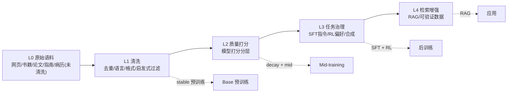
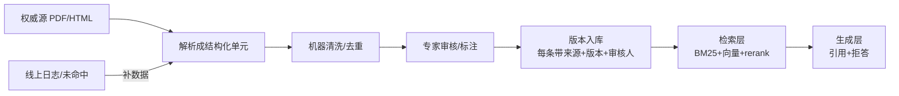

# MiniCPM 训练流程对比（2B / 1B / 自训小模型 / 医学垂域）

> 基于仓库 `README-cn.md` 中官方公开的 **MiniCPM5-2B / MiniCPM5-1B** 训练配方整理。
> “自训小模型”与“医学垂域”两列为本地实操建议，按 RTX 2080 Ti 22GB（仅 FP16）预算给出。

## 一、总览对比表

| 阶段 | MiniCPM5-2B（官方） | MiniCPM5-1B（官方） | 自训小模型（0.3B~0.5B） | 医学垂域模型 |
|---|---|---|---|---|
| **规模/定位** | 2B 稠密，端侧 SOTA | 1B 稠密，端侧 SOTA | 0.3B 稠密（首选）/ 0.5B | 复用现成 Base，0.3B/1B 均可 |
| **Base 预训练** | stable + decay 逐级推进 | stable + decay 逐级推进 | stable 8~16B + decay 1~2B tokens | 跳过，直接用 Base |
| **预训练语料** | Ultra-FineWeb/-L3/UltraX/Code/Math | Ultra-FineWeb/-L3/Math | Ultra-FineWeb(切片) + Math/Code | 医学指南/教材/论文/病历(脱敏)/题库 |
| **Mid-training** | 强化目标能力、适配分布 | 同左 | 1~3B tokens 补 Math/Code | = CPT，继续预训练注入医学知识 |
| **SFT** | 400B deep-thinking | 200B deep + 200B hybrid | 1~3B tokens，deep/hybrid 各半 | 医学问答/考试题/病历摘要/医患对话 |
| **RL** | JustRL II（critic-based），16 专家 | DAPO-Math-17k + JustRL 极简配方 | DPO/KTO 代餐，RL 只做极小验证 | DPO/KTO 对齐（安全、合规、拒答） |
| **OPD/蒸馏** | 反向 KL 合并 16 专家 | 反向 KL + 双边 top-k 取并集 | 跳过 / 单教师跑通概念 | 跳过 |
| **量化/部署** | GGUF/MLX/GPTQ | GGUF/MLX | GGUF/MLX | GGUF/MLX，端侧部署 |
| **评测** | 公开榜 + Agent | 工具调用 + 代码 | CEVAL/CMMLU、GSM8K、MBPP、大海捞针 | MedQA(USMLE)、CMMLU-Medical、CMExam、执业医师 |

## 二、自训小模型各阶段怎么弄

### 0. 规模选择
- 首选 **0.3B**：迭代快、显存宽裕、能跑全参；0.5B 是“愿意等”的上限。
- 架构：**密集 Transformer + GQA + RoPE**，参考 Qwen3-0.6B / MiniCPM4-0.5B 再缩一档（约 hidden 1024 / 24 层 / 16 头）。
- **词表直接复用 Qwen2.5 或 MiniCPM5 的 tokenizer**，省去训 tokenizer 成本。

### 1. Base 预训练
- stable 用 `Ultra-FineWeb`（普通网页），最后 10% 用 L2/L3 切片做 decay；Code/Math 放后面。
- 规模量级（13 TFLOPS、MFU 约 35% 估算）：
  - 0.3B × 2~3B tokens ≈ **10~15 天**（跑通流程）
  - 0.3B × 10B tokens ≈ **40~50 天**（可用的基座，可 checkpoint 续训）
- 工程必开：流式数据（`IterableDataset`）+ 梯度累积 + 激活检查点 + ZeRO-2/3。

### 2. Mid-training
- 1~3B tokens，补 `UltraData-Math` / `UltraData-Code` 的 L3 切片，上下文 8K → 32K（可 YaRN 外推）。

### 3. SFT
- **1~3B tokens** 即够；deep-thinking 与 hybrid-thinking 各半。
- 数据从 `UltraData-SFT-2605` 切片；先在 1B/2B 上 LoRA 验证数据质量，0.3B 直接全参。

### 4. RL
- 先 **DPO/KTO 代餐**（`finetune/llama_factory_example/` 有 minicpm_dpo.yaml / minicpm_kto.yaml）。
- 要练 RL 手感：DAPO-Math-17k 用 verl/trl 跑极小规模（1k prompt × 少量 rollout）。

### 5. OPD/蒸馏
- 直接跳过；想理解概念，手写“单教师反向-KL logits 蒸馏”脚本几小时跑通即可。

### 6. 量化 / 评测
- 部署走 GGUF（llama.cpp）/ MLX（`docs/deployment/` 有教程）。
- 评测：`quantize/quantize_eval.sh`（困惑度）+ lm-eval-harness 跑 CEVAL/CMMLU、GSM8K、MBPP、大海捞针。

## 三、医学垂域各阶段怎么弄

### 1. 基座选择
- 用 `MiniCPM5-1B-Base` / `MiniCPM5-2B-Base`（不是 chat 成品）做 CPT，避免模板痕迹污染。
- 1B/2B 容量更稳（医学知识密集）；2080 Ti 上 1B 全参 CPT 吃紧，可 LoRA CPT 或 0.3B 全参。

### 2. 数据（决定上限）
- 四类拼装：① 教材/指南/论文；② 病历/报告（脱敏）；③ 考试题库（MedQA、CMExam、执业/中医执医）；④ 医患问答。
- **务必脱敏 + 加医疗免责声明模板**（合规红线）。
- 规模：CPT 几 B~十几 B tokens（切片流式），SFT 1~3B tokens。

### 3. CPT（= mid-training）
- 医学语料里**混 10~20% 通用语料**（Ultra-FineWeb 切片）防灾难性遗忘。
- 用 LLaMA-Factory 的 pretrain/CPT 模式：0.3B 全参，1B/2B LoRA。

### 4. SFT
- 任务型数据：医学问答（带推理）、考试解析、病历摘要、鉴别诊断、医患对话。
- 沿用 MiniCPM 的 ChatML 格式，复用 `finetune.py` / LLaMA-Factory SFT，LoRA 起步。

### 5. RL（对齐 + 安全）
- 不做 RLVR，改用 **DPO/KTO**：正样本=专业稳妥、循证；负样本=越界诊断、无依据断言、该拒答乱答。
- 改 `minicpm_dpo.yaml` / `minicpm_kto.yaml` 数据即可。

### 6. 评测与安全
- 知识：MedQA(USMLE)、CMMLU-Medical、CMExam、执业医师、中医体质。
- 安全：单独测“识别越界问题并拒答/引导就医”，与分数同等重要。

### 7. 部署
- GGUF/MLX 端侧推理；system prompt 里写免责声明。

## 四、复现 MiniCPM 数据管线（过敏垂域从零开始）

MiniCPM 的数据管线本质是 **UltraData 的 L0→L4 分级治理**，不同级别喂给不同训练阶段。“连原始数据都没有”反而是最干净的状态，可从第一性原理逐步搭建。



| 级别 | 内容 | 喂给哪个阶段 | 过敏垂域对应物 |
|---|---|---|---|
| L0 | 原始未清洗语料 | — | 爬的网页、医学教材 PDF、论文、脱敏病历 |
| L1 | 去重+过滤后的干净文本 | stable 预训练 | 医学正文 + 混入的通用文本 |
| L2 | 质量打分层 | decay + mid | 高分医学知识文本（指南/论文） |
| L3 | 任务化指令数据 | SFT + RL | 过敏问答、鉴别诊断、考试题、偏好对 |
| L4 | 检索增强 | RAG | 过敏原数据库、指南检索 |

### 1. 原始数据从哪来（0 起步采集清单）

过敏垂域太小，纯靠公开数据不够，配比建议：**公开综合医学数据筛选 60% + 定向采集 20% + 自建/合成 20%**。

- **公开现成（先从这里起步）**：`shibing624/medical`、`FreedomIntelligence/HuatuoGPT-sft-data-v1`（中文）；`openlifescienceai/medmcqa`、`GBaker/MedQA-USMLE-4-options`（英文）；过敏专项 `hugging-science/gut-microbiome-allergy-data`、`MQareen/allergen-ner-dataset-v2`。
- **定向采集原始文本（= L0）**：PubMed Central 开放论文（BioC 格式）、中文临床指南 PDF（转文本）、NMPA/FDA 药品说明书（含不良反应/禁忌/过敏字段）、欧盟 14 类过敏原清单。
- **自建/合成（决定上限）**：手上的过敏专业资料整理成 Q&A；用现成大模型做数据合成。

### 2. L0 → L1（清洗）

- 格式统一：PDF/网页 → 纯文本，去页眉页脚/导航/HTML。
- 语言识别：`fastText` 的 `lid.176.bin`，中英分桶。
- 启发式过滤：去短文本（<100 字符）、去乱码、去高 URL 比例。
- 去重：**MinHash + LSH**（`datasketch`）近似去重，再 **SimHash** 精确去重。

```python
def clean_heuristic(text: str):
    t = text.strip()
    if len(t) < 100: return None                     # 太短
    if t.count("http") / max(len(t), 1) > 0.01: return None  # URL 过多
    if len(set(t)) / max(len(t), 1) < 0.2: return None       # 重复字符异常
    return t
```

### 3. L1 → L2（质量打分，UltraData 核心分水岭）

- 轻量法：fastText / 小 BGE 分类器打分（教育性、医学相关性、格式规范度）。
- 实用法：perplexity 过滤——中段保留，过高(噪声)/过低(刷屏)丢弃。
- 过敏垂域额外加“领域相关性”分（allergy/allergen/anaphylaxis/atopic/asthma/免疫 等词加权）。

### 4. L3（任务化，SFT/RL 数据，最重要）

**SFT 指令数据（复用 ChatML 格式，参考 `finetune/data_processing.ipynb`）**，分五类：
过敏问答（带推理链）、鉴别诊断、考试题解析（USMLE/执业医师）、药物禁忌、医患对话。

```json
{"messages": [
  {"role": "user", "content": "患者对青霉素过敏，能否使用阿莫西林？"},
  {"role": "assistant", "content": "不建议。阿莫西林与青霉素同属β-内酰胺类，存在交叉过敏风险……建议改用大环内酯类并做皮试。"}
]}
```

**RL 偏好数据（DPO/KTO）**：正样本=稳妥、循证、给替代方案；负样本=越界诊断、无依据断言、该拒答乱答。用大模型“改写坏版本”批量造偏好对。

### 5. L4（RAG / 可验证数据）

过敏原数据库、指南结构化后进向量库（BGE embedding + FAISS）做检索增强——过敏垂域大量“查表型”知识（14 类过敏原、交叉反应表）尤其适合 RAG，独立于训练随时可加。

### 6. 最小可跑路线（按序推进，每步可单独验证）

1. **先做 L3-SFT**：`shibing624/medical` + `medmcqa` 筛过敏条目 → 转 ChatML → 跑 `lora_finetune.sh`（最快见效）。
2. **再做 L1**：收集原始文本清洗去重，积累几 GB 干净医学文本。
3. **再做 L2**：给清洗后文本打分，分出一小批“高质量 L2”做 CPT。
4. **最后做 L3-RL**：DPO 偏好对 + 安全拒答。
5. **L4（RAG）**：独立于训练，随时可加。

## 五、构建生产级高质量知识库

> 核心认知：生产级 KB ≠ “文档切块 + 向量检索”。本质是**被审核过的、可溯源的、结构化的、可持续更新的领域知识资产**。

### 1. RAG 不是和基模“比知识量”

基模训练见过海量数据，但生产落地要的是四点，基模给不了：

| 生产需求 | 基模（纯记忆） | 知识库 + RAG |
|---|---|---|
| 准确不编造 | ❌ 小模型易幻觉 | ✅ 检索原文照说 |
| 可溯源 | ❌ 不知依据哪 | ✅ 引用指南/说明书出处 |
| 可更新 | ❌ 知识冻结 | ✅ 加文档即可 |
| 可私有/可控 | ❌ 内部数据没有 | ✅ 私有指南/病例库 |

**医疗场景这四点不是加分项，是及格线。**

### 2. 先定四件事（不定就做，后面全返工）

- **服务对象**：患者科普 / 医生辅助 / 内部客服——决定深度与溯源级别。
- **覆盖边界**：如过敏性鼻炎/哮喘/特应性皮炎/慢性荨麻疹/食物过敏/药物过敏/过敏性休克/AIT 脱敏等 10 个主题。
- **溯源标准**：必须引用到“指南段落 + 版本号 + 日期”，还是给个来源即可。
- **更新机制**：谁发现指南更新、多久复审。

### 3. 数据源权威分级（生产只进 S/A 级）

| 级别 | 来源 | 是否入库 |
|---|---|---|
| **S 必须** | 权威指南（EAACI/WAO/GINA/ARIA、中华医学会）、NMPA/FDA 说明书、IUIS 过敏原 | ✅ 全部 |
| **A 优先** | 专科教科书、UpToDate 类、专科综述、真实脱敏病历 | ✅ 精选 |
| **B 参考** | 官方科普（CDC/WHO）、考试题 | 仅打底 |
| **私有** | 内部 SOP、真实病例、专家 Q&A | ✅ 最有价值 |

### 4. 知识形态：结构化单元 > 文本块（最大区别）

| 形态 | 例子 | 存储 |
|---|---|---|
| 事实型（查表） | 过敏原交叉反应矩阵、β内酰胺交叉过敏表、肾上腺素剂量表 | 结构化表/JSON |
| 概念型 | 疾病定义、发病机制 | 条目（标题+正文+来源） |
| 流程型 | 过敏性休克急救、AIT 脱敏步骤 | 有序步骤 |
| 问答型 | 高频问题标准答案 | Q&A 对 |

查表型知识检索“文档块”又慢又错，应直接查结构化表返回精确结果。

### 5. 加工管线（含审核与版本，护城河所在）



分水岭在 **D 专家审核 + E 版本管理**——没有这两步，库不敢上线。

### 6. 质量评估（可回归，不是“感觉好”）

- 建 100 条真实问题 + 标准答案 + 必引来源的评测集。
- 每次改数据/检索跑一遍：命中率、引用准确率、拒答率。
- 专家抽检：每月随机 50 条人工打分。

### 7. 从“练管线”到“生产”的差距清单

| 已有 | 还缺 |
|---|---|
| ✅ 采集/清洗/切块管线 | ❌ 结构化单元设计 |
| ✅ 公开知识块 | ❌ S/A 级权威数据（指南/说明书原文） |
| ✅ 来源分层 tier | ❌ 专家审核 + 版本管理 |
| — | ❌ 评测集 + 回归测试 |
| — | ❌ 更新机制 |
| — | ❌ 检索层（BM25+向量+rerank）+ 拒答机制 |

### 8. MVP 路径

1. 定边界：只做 1 个主题（如“药物过敏”）。
2. 50~100 条 S 级数据：人工整理成结构化单元（每条带来源）。
3. 30 条评测集。
4. 跑通检索闭环：向量检索 + 引用 + 检索不到就拒答。
5. 内测 → 收集答错/未命中 → 补数据 → 循环。

**心法**：生产级 KB 的 80% 工作量在“权威数据获取与审核、结构化设计、评测集”，技术管线只占 20%。
